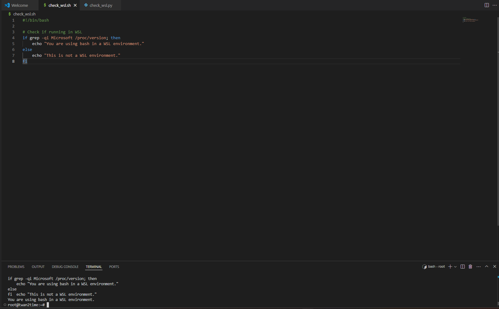
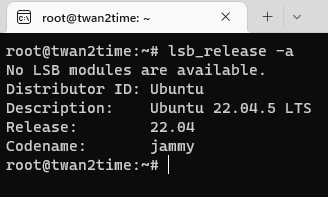
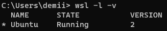

## A05

### Antwan Taylor

### Description:

For this assignment I downloaded WSL 

### Instructions

|  #  | Step                               | Description                                                                                     |  
| :-: | ---------------------------------- | ----------------------------------------------------------------------------------------------- |  
|  1  | Check WSL Status                   | Run `wsl -l -v` to list installed Linux distributions and their states; screenshot the output.  |  
|  2  | Verify Linux Distro Details        | Run `lsb_release -a` to confirm distro details; screenshot the output for submission.           |  
|  3  | Inspect WSL Configuration          | Run `ls -l /etc/wsl* && cat /etc/wsl.conf` to view configuration; include the output screenshot.|  
|  4  | Configure Bash in VSCode           | Set the integrated terminal to bash via View > Terminal; screenshot the bash prompt.            |  
|  5  | Execute Bash Command or Script     | Run a simple bash script to verify WSL usage; document results for submission.                  |  

### Screenshots

 

