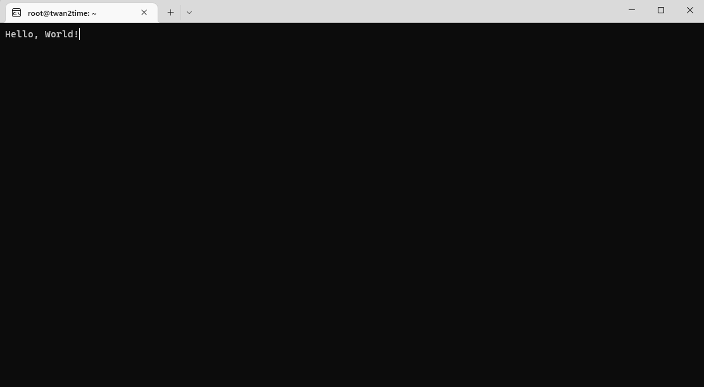

### P02A - Ncurses Test  

## Description  

This program tests the installation of the `ncurses` library on Windows 11 using Windows Subsystem for Linux (WSL). It involves writing a simple C++ program that uses the `ncurses` library to display a "Hello, World!" message on the screen. The program demonstrates the basic functionality of `ncurses` in initializing the screen, displaying a message, and waiting for user input before closing the program.

## Steps  

1. **Install WSL** on Windows 11.  
2. **Install the ncurses library** on WSL.  
3. **Write a simple "Hello, World!" program** using ncurses to test if the installation is successful.  
4. **Compile and run the program** using `g++` and link it with the `ncurses` library.

## Program Flow  

- The program initializes the ncurses environment.  
- It displays "Hello, World!" on the screen.  
- It waits for user input before ending the program and restoring normal terminal behavior.  

## Files  

- `hello_ncurses.cpp`: The C++ source code for the "Hello, World!" program using the `ncurses` library.  

### Screenshots Below:

